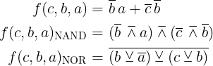
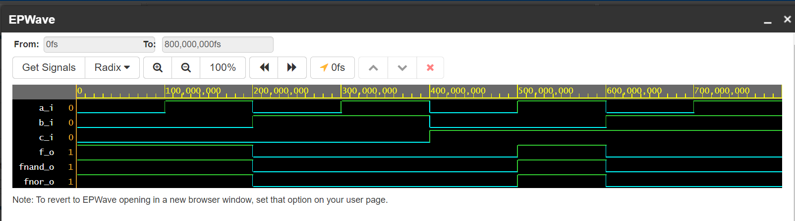
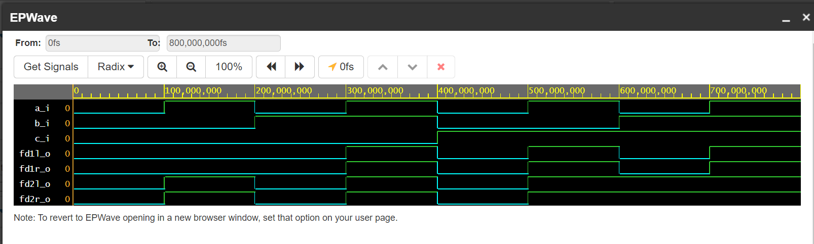

# Lab 1

### GitHub link
[GitHub link to Digital-electronics-1 repository](https://github.com/xrozbo03/Digital-electronics-1)

### Verification of De Morgan's laws of function f(c,b,a):



```VHDL
------------------------------------------------------------------------
-- Entity declaration for basic gates
------------------------------------------------------------------------
entity gates is
    port(
        a_i     : in  std_logic;         -- Data input
        b_i     : in  std_logic;         -- Data input
        c_i     : in  std_logic;         -- Data input
        f_o     : out std_logic;         -- F output function
        fnand_o : out std_logic;         -- NAND output function
        fnor_o  : out std_logic          -- NOR output function
    );
end entity gates;

------------------------------------------------------------------------
-- Architecture body for basic gates
------------------------------------------------------------------------
architecture dataflow of gates is
begin
-- De Morgan's laws
    f_o     <= ((not b_i) and a_i) or ((not c_i) and (not b_i));
    fnand_o <= (((not b_i) nand a_i) nand ((not c_i) nand (not b_i)));
    fnor_o  <= not ((b_i nor (not a_i) ) nor (c_i nor b_i));
end architecture dataflow;
```

| **c** | **b** |**a** | **f(c,b,a)** |
| :-: | :-: | :-: | :-: |
| 0 | 0 | 0 | 1 |
| 0 | 0 | 1 | 1 |
| 0 | 1 | 0 | 0 |
| 0 | 1 | 1 | 0 |
| 1 | 0 | 0 | 0 |
| 1 | 0 | 1 | 1 |
| 1 | 1 | 0 | 0 |
| 1 | 1 | 1 | 0 |



[EDA Playground link](https://www.edaplayground.com/x/LerG)


### Verification of Distributive laws:


```VHDL
------------------------------------------------------------------------
-- Entity declaration for basic gates
------------------------------------------------------------------------
entity gates is
    port(
        a_i     : in  std_logic;         -- Data input
        b_i     : in  std_logic;         -- Data input
        c_i     : in  std_logic;         -- Data input
        fd1l_o  : out std_logic;
        fd1r_o	: out std_logic;
        fd2l_o  : out std_logic;
        fd2r_o	: out std_logic
    );
end entity gates;

------------------------------------------------------------------------
-- Architecture body for basic gates
------------------------------------------------------------------------
architecture dataflow of gates is
begin
-- Distributive laws
	fd1l_o	<= (a_i and b_i) or (a_i and c_i);
    fd1r_o	<= a_i and (b_i or c_i);
    fd2l_o	<= (a_i or b_i) and (a_i or c_i);
    fd2r_o	<= a_i or (b_i and c_i);
end architecture dataflow;
```



[EDA Playground link](https://www.edaplayground.com/x/LerG)