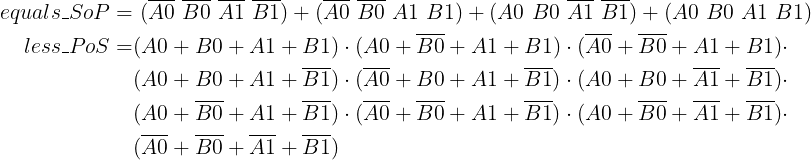
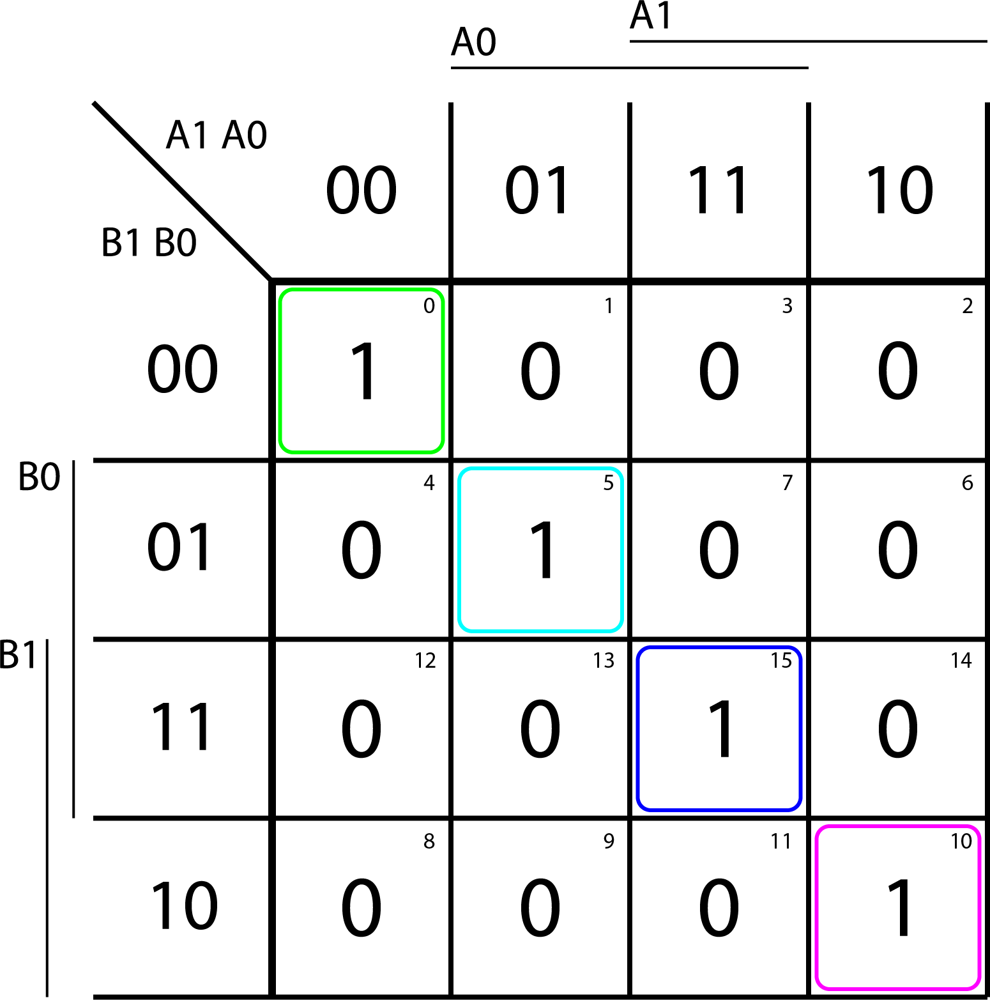
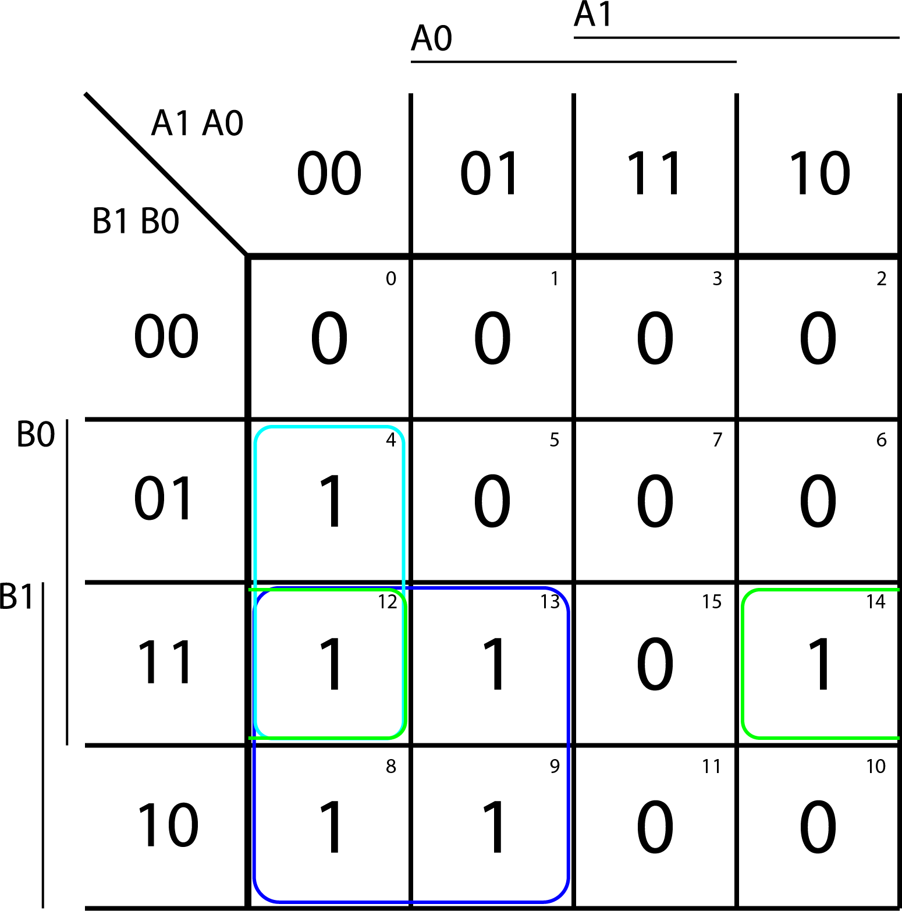
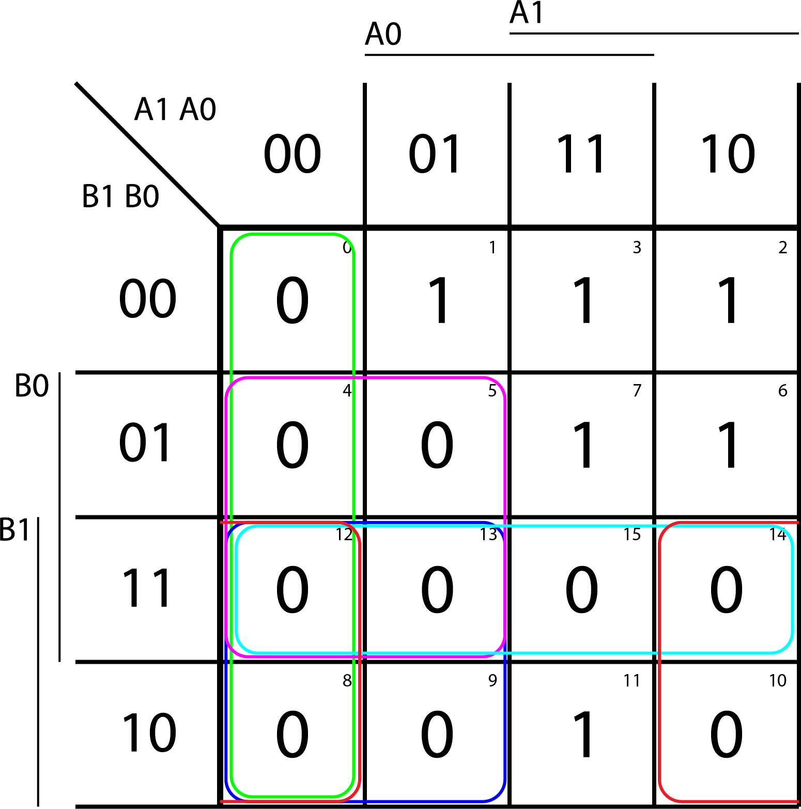
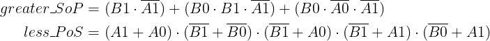
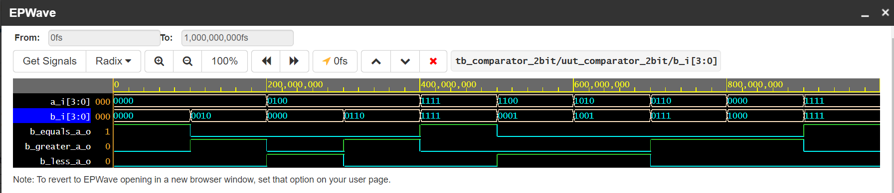

# Lab 2: Combinational logic

## 1. Preparation

| **Dec. equivalent** | **B[1:0]** | **A[1:0]** | **B is greater than A** | **B equals A** | **B is less than A** |
| :-: | :-: | :-: | :-: | :-: | :-: |
| 0 | 0 0 | 0 0 | 0 | 1 | 0 |
| 1 | 0 0 | 0 1 | 0 | 0 | 1 |
| 2 | 0 0 | 1 0 | 0 | 0 | 1 |
| 3 | 0 0 | 1 1 | 0 | 0 | 1 |
| 4 | 0 1 | 0 0 | 1 | 0 | 0 |
| 5 | 0 1 | 0 1 | 0 | 1 | 0 |
| 6 | 0 1 | 1 0 | 0 | 0 | 1 |
| 7 | 0 1 | 1 1 | 0 | 0 | 1 |
| 8 | 1 0 | 0 0 | 1 | 0 | 0 |
| 9 | 1 0 | 0 1 | 1 | 0 | 0 |
| 10 | 1 0 | 1 0 | 0 | 1 | 0 |
| 11 | 1 0 | 1 1 | 0 | 0 | 1 |
| 12 | 1 1 | 0 0 | 1 | 0 | 0 |
| 13 | 1 1 | 0 1 | 1 | 0 | 0 |
| 14 | 1 1 | 1 0 | 1 | 0 | 0 |
| 15 | 1 1 | 1 1 | 0 | 1 | 0 |



## 2. A 2-bit comparator.

Karnaugh map for "equals" function



Karnaugh map for "greater than" function



Karnaugh map for "less than" function






## 3. A 4-bit binary comparator.

### design.vhdl

```VHDL
library ieee;
use ieee.std_logic_1164.all;

------------------------------------------------------------------------
-- Entity declaration for 2-bit binary comparator
------------------------------------------------------------------------
entity comparator_2bit is
    port(
        a_i           : in  std_logic_vector(4 - 1 downto 0);
        b_i           : in  std_logic_vector(4 - 1 downto 0);

        B_greater_A_o   : out std_logic;
        B_equals_A_o    : out std_logic;
        B_less_A_o      : out std_logic       -- B is less than A
    );
end entity comparator_2bit;

------------------------------------------------------------------------
-- Architecture body for 2-bit binary comparator
------------------------------------------------------------------------
architecture Behavioral of comparator_2bit is
begin
    B_greater_A_o  <= '1' when (b_i > a_i) else '0';
    B_equals_A_o   <= '1' when (b_i = a_i) else '0';
    B_less_A_o     <= '1' when (b_i < a_i) else '0';

end architecture Behavioral;
```

### testbench.vhdl

```VHDL
------------------------------------------------------------------------
-- Entity declaration for testbench
------------------------------------------------------------------------
entity tb_comparator_2bit is
    -- Entity of testbench is always empty
end entity tb_comparator_2bit;

------------------------------------------------------------------------
-- Architecture body for testbench
------------------------------------------------------------------------
architecture testbench of tb_comparator_2bit is

    -- Local signals
    signal s_a       : std_logic_vector(4 - 1 downto 0);
    signal s_b       : std_logic_vector(4 - 1 downto 0);
    signal s_B_greater_A : std_logic;
    signal s_B_equals_A  : std_logic;
    signal s_B_less_A    : std_logic;

begin
    -- Connecting testbench signals with comparator_2bit entity (Unit Under Test)
    uut_comparator_2bit : entity work.comparator_2bit
        port map(
            a_i           => s_a,
            b_i           => s_b,
            B_greater_A_o => s_B_greater_A,
            B_equals_A_o  => s_B_equals_A,
            B_less_A_o    => s_B_less_A
        );

    --------------------------------------------------------------------
    -- Data generation process
    --------------------------------------------------------------------
    p_stimulus : process
    begin
        -- Report a note at the begining of stimulus process
        report "Stimulus process started" severity note;

		-- test 01
        s_b <= "0000"; s_a <= "0000"; wait for 100 ns;
        -- Expected output
        assert ((s_B_greater_A = '0') and (s_B_equals_A = '1') and (s_B_less_A = '0'))
        -- If false, then report an error
        report "Test failed for input combination: 0000, 0000" severity error;
        
        -- test 02
        s_b <= "0010"; s_a <= "0000"; wait for 100 ns;
        -- Expected output
        assert ((s_B_greater_A = '1') and (s_B_equals_A = '0') and (s_B_less_A = '0'))
        -- If false, then report an error
        report "Test failed for input combination: 0010, 0000" severity error;
        
        -- test 03
        s_b <= "0000"; s_a <= "0100"; wait for 100 ns;
        -- Expected output
        assert ((s_B_greater_A = '0') and (s_B_equals_A = '0') and (s_B_less_A = '1'))
        -- If false, then report an error
        report "Test failed for input combination: 0000, 0100" severity error;
        
        -- test 04
        s_b <= "0110"; s_a <= "0100"; wait for 100 ns;
        -- Expected output
        assert ((s_B_greater_A = '1') and (s_B_equals_A = '0') and (s_B_less_A = '0'))
        -- If false, then report an error
        report "Test failed for input combination: 0110, 0100" severity error;
        
        -- test 05
        s_b <= "1111"; s_a <= "1111"; wait for 100 ns;
        -- Expected output
        assert ((s_B_greater_A = '0') and (s_B_equals_A = '1') and (s_B_less_A = '0'))
        -- If false, then report an error
        report "Test failed for input combination: 1111, 1111" severity error;
        
        -- test 06
        s_b <= "0001"; s_a <= "1100"; wait for 100 ns;
        -- Expected output
        assert ((s_B_greater_A = '0') and (s_B_equals_A = '0') and (s_B_less_A = '1'))
        -- If false, then report an error
        report "Test failed for input combination: 0001, 1100" severity error;
        
        -- test 07
        s_b <= "1001"; s_a <= "1010"; wait for 100 ns;
        -- Expected output
        assert ((s_B_greater_A = '0') and (s_B_equals_A = '0') and (s_B_less_A = '1'))
        -- If false, then report an error
        report "Test failed for input combination: 1001, 1010" severity error;
        
        -- test 08
        s_b <= "0111"; s_a <= "0110"; wait for 100 ns;
        -- Expected output
        assert ((s_B_greater_A = '1') and (s_B_equals_A = '0') and (s_B_less_A = '0'))
        -- If false, then report an error
        report "Test failed for input combination: 0111, 0110" severity error;
        
        -- test 09
        s_b <= "1000"; s_a <= "0000"; wait for 100 ns;
        -- Expected output
        assert ((s_B_greater_A = '1') and (s_B_equals_A = '0') and (s_B_less_A = '0'))
        -- If false, then report an error
        report "Test failed for input combination: 1000, 0000" severity error;
        
        -- test 10 ERROR
        s_b <= "1111"; s_a <= "1111"; wait for 100 ns;
        -- Expected output
        assert ((s_B_greater_A = '1') and (s_B_equals_A = '0') and (s_B_less_A = '0'))
        -- If false, then report an error
        report "Test failed for input combination: 1111, 1111" severity error;


        -- Report a note at the end of stimulus process
        report "Stimulus process finished" severity note;
        wait;
    end process p_stimulus;

end architecture testbench;
```



[EDA Playground link](https://www.edaplayground.com/x/DSMt)