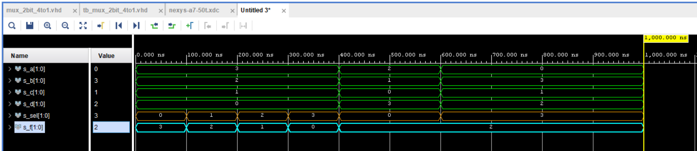

# Lab 3: Introduction to Vivado

## 1. Preparation

| **LED** | **connection** | **x** | **Switch** | **connection** |
| :---: | :---: | :---: | :---: | :---: |
| LED 0 | 1 | x | SW 0 | 0 |
| LED 1 | 1 | x | SW 1 | 0 |
| LED 2 | 1 | x | SW 2 | 0 |
| LED 3 | 1 | x | SW 3 | 0 |
| LED 4 | 1 | x | SW 4 | 0 |
| LED 5 | 1 | x | SW 5 | 0 |
| LED 6 | 1 | x | SW 6 | 0 |
| LED 7 | 1 | x | SW 7 | 0 |
| LED 8 | 1 | x | SW 8 | 0 |
| LED 9 | 1 | x | SW 9 | 0 |
| LED 10 | 1 | x | SW 10 | 0 |
| LED 11 | 1 | x | SW 11 | 0 |
| LED 12 | 1 | x | SW 12 | 0 |
| LED 13 | 1 | x | SW 13 | 0 |
| LED 14 | 1 | x | SW 14 | 0 |
| LED 15 | 1 | x | SW 15 | 0 |

## 2. Two-bit wide 4-to-1 multiplexer

### VHDL architecture from source file mux_2bit_4to1.vhd

```VHDL
architecture Behavioral of mux_2bit_4to1 is
begin

    f_o <=  a_i when (sel_i = "00") else
            b_i when (sel_i = "01") else
            c_i when (sel_i = "10") else
            d_i;

end architecture Behavioral;
```

### VHDL stimulus process from testbench file tb_mux_2bit_4to1.vhd

```VHDL
 p_stimulus : process
    begin
        -- Report a note at the begining of stimulus process
        report "Stimulus process started" severity note;


        s_d <= "00"; s_c <= "01"; s_b <= "10"; s_a <= "11";
        s_sel <= "00"; wait for 100 ns;
        
        s_sel <= "01"; wait for 100 ns;
        
        s_sel <= "10"; wait for 100 ns;

        s_sel <= "11"; wait for 100 ns;
     
        s_d <= "11"; s_c <= "00"; s_b <= "01"; s_a <= "10";
        s_sel <= "00"; wait for 100 ns;
        
        s_sel <= "00"; wait for 100 ns;
        
        s_d <= "10"; s_c <= "01"; s_b <= "11"; s_a <= "00";
        s_sel <= "11"; wait for 100 ns;

        s_sel <= "11"; wait for 100 ns;

        -- Report a note at the end of stimulus process
        report "Stimulus process finished" severity note;
        wait;
    end process p_stimulus;
```

### Screenshot with simulated time waveforms



## 3. A Vivado tutorial