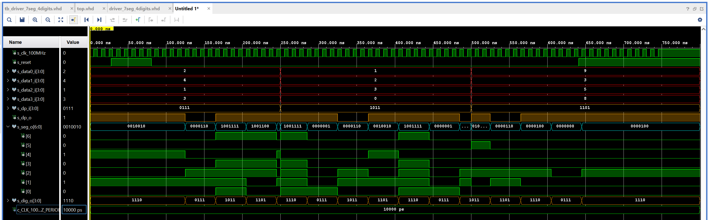

# Lab 6: Driver for multiple seven-segment displays

## 1. Preparation

### Timing diagram figure for displaying value `3.142`


## 2. Display driver

### Listing of VHDL code of the process `p_mux`

```vhdl

```

### Listing of VHDL testbench file `tb_driver_7seg_4digits`

```vhdl

```

### Screenshot with simulated time waveforms



### Listing of VHDL architecture of the top layer

```vhdl

```

## 3. Eight-digit driver

### Image of the driver schematic

