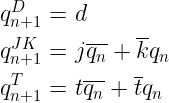
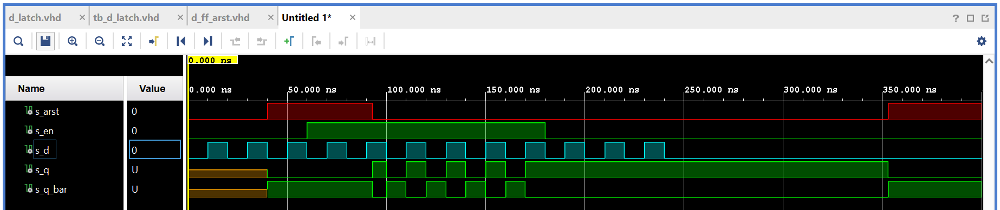
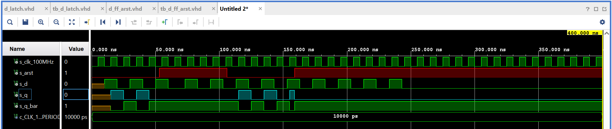
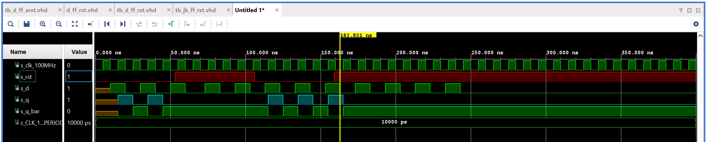
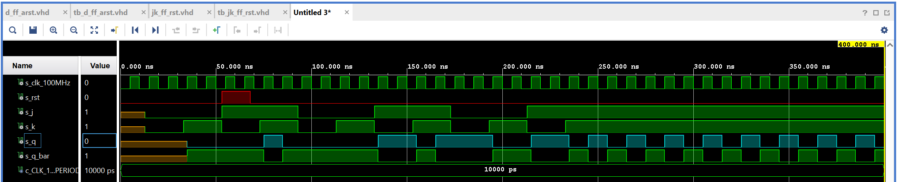
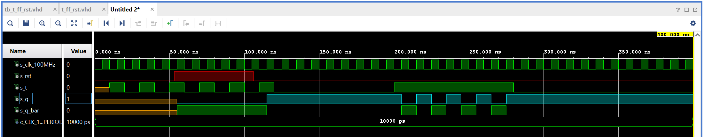
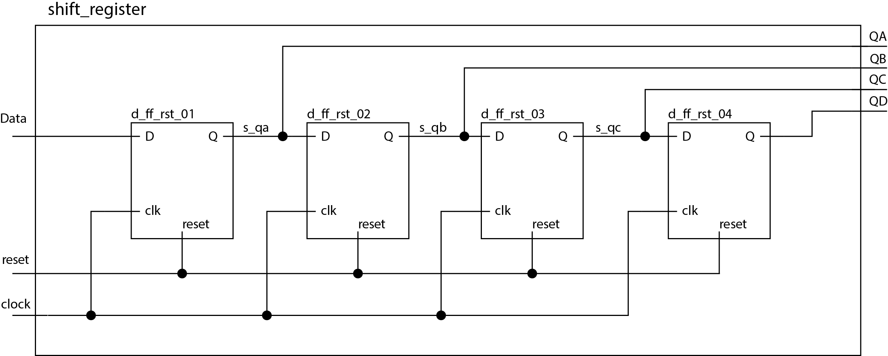

# Lab 7: Latches and Flip-flops

## 1. Preparation

### Characteristic equations and completed tables for D, JK, T flip-flops



| **clk** | **D** | **qn** | **q(n+1)** | **Comments** |
| :-: | :-: | :-: | :-: | :-- |
|  | 0 | 0 | 0 | No change |
|  | 0 | 1 | 0 | RESET |
|  | 1 | 0 | 1 | No change    |
|  |   1   | 1 | 1 | SET          |

| **clk** | **J** | **K** | **qn** | **q(n+1)** | **Comments** |
| :-: | :-: | :-: | :-: | :-: | :-- |
|  | 0 | 0 | 0 | 0 | No change |
|  | 0 | 0 | 1 | 1 | No change |
|  | 0 | 1 | 0 | 0 | RESET |
|  | 0 | 1 | 1 | 0 | RESET |
|  | 1 | 0 | 0 | 1 | SET |
|  | 1 | 0 | 1 | 1 | SET |
|  | 1 | 1 | 0 | 1 | Toggle |
|  | 1 | 1 | 1 | 0 | Toggle |

| **clk** | **T** | **qn** | **q(n+1)** | **Comments** |
| :-: | :-: | :-: | :-: | :-- |
|  | 0 | 0 | 0 | No change |
|  | 0 | 1 | 1 | No change |
|  | 1 | 0 | 1 | Invert (Toggle) |
|  | 1 | 1 | 0 | Invert (Toggle) |

## 2. D latch.

### VHDL code listing of the process `p_d_latch`

```vhdl
 p_d_latch : process (d, arst, en)
    begin
        if (arst = '1') then
            q     <= '0';
            q_bar <= '1';
        elsif (en = '1') then
            q     <= d;
            q_bar <= not d;
        end if;
        
    end process p_d_latch;
```

### Listing of VHDL reset and stimulus processes from the testbench `tb_d_latch`

```vhdl
--------------------------------------------------------------------
-- Reset generation process
--------------------------------------------------------------------
 p_reset_gen : process
    begin
        s_arst <= '0';
        wait for 40 ns;
        
        s_arst <= '1';
        wait for 53 ns;
        
        s_arst <= '0';
        wait for 260 ns;
        
        s_arst <= '1';
        wait;
    end process p_reset_gen;
    
--------------------------------------------------------------------
-- Data generation process
--------------------------------------------------------------------
     p_stimulus : process
    begin
        report "Stimulus process started" severity note;
        s_d   <= '0';
        s_en  <= '0';
        
        -- d sekv
        wait for 10 ns;
        s_d   <= '1';
        wait for 10 ns;
        s_d   <= '0';
        wait for 10 ns;
        s_d   <= '1';
        wait for 10 ns;
        s_d   <= '0';
        wait for 10 ns;
        s_d   <= '1';
        
        wait for 5 ns;
        -- Expected output
        assert ((s_q = '0') and (s_q_bar = '1'))
        -- If false, then report an error
        report "Test failed for input on 55ns" severity error;
        
        wait for 5 ns;
        s_d   <= '0';
        --/d sekv
        
        s_en   <= '1';
        
        -- d sekv
        wait for 10 ns;
        s_d   <= '1';
        wait for 10 ns;
        s_d   <= '0';
        wait for 10 ns;
        s_d   <= '1';
        wait for 10 ns;
        s_d   <= '0';
        wait for 10 ns;
        s_d   <= '1';
        wait for 10 ns;
        s_d   <= '0';
        --/d sekv
        
        -- d sekv
        wait for 10 ns;
        s_d   <= '1';
        
        wait for 5 ns;
         -- Expected output
        assert ((s_q = '1') and (s_q_bar = '0'))
        -- If false, then report an error
        report "Test failed for input on 135ns" severity error;
        
        wait for 5 ns;
        s_d   <= '0';
        wait for 10 ns;
        s_d   <= '1';
        wait for 10 ns;
        s_d   <= '0';
        wait for 10 ns;
        s_d   <= '1';
        wait for 10 ns;
        s_d   <= '0';
        --/d sekv
        
        s_en  <= '0';
        
        -- d sekv
        wait for 10 ns;
        s_d   <= '1';
        wait for 10 ns;
        s_d   <= '0';
        wait for 10 ns;
        s_d   <= '1';
        wait for 10 ns;
        s_d   <= '0';
        wait for 10 ns;
        s_d   <= '1';
        wait for 10 ns;
        s_d   <= '0';
        --/d sekv
        
        wait for 35 ns;
        -- Expected output
        assert ((s_q = '1') and (s_q_bar = '0'))
        -- If false, then report an error
        report "Test failed for input on 275ns" severity error;
        
        wait for 100 ns;
        -- Expected output
        assert ((s_q = '0') and (s_q_bar = '1'))
        -- If false, then report an error
        report "Test failed for input on 375ns" severity error;
        
        report "Stimulus process finished" severity note;
        wait;
    end process p_stimulus;
```

### Screenshot with simulated time waveforms



## 3. Flip-flops

### `p_d_ff_arst`

#### VHDL code listing of the processes

```vhdl

```

#### Listing of VHDL clock, reset and stimulus processes from the testbench

```vhdl

```

#### Screenshot, with simulated time waveforms



### `p_d_ff_rst`

#### VHDL code listing of the processes

```vhdl

```

#### Listing of VHDL clock, reset and stimulus processes from the testbench

```vhdl

```

#### Screenshot, with simulated time waveforms



### `p_jk_ff_rst`

#### VHDL code listing of the processes

```vhdl

```

#### Listing of VHDL clock, reset and stimulus processes from the testbench

```vhdl

```

#### Screenshot, with simulated time waveforms



### `p_t_ff_rst`

#### VHDL code listing of the processes

```vhdl

```

#### Listing of VHDL clock, reset and stimulus processes from the testbench

```vhdl

```

#### Screenshot, with simulated time waveforms



## 4. Shift register

### Image of the shift register schematic

